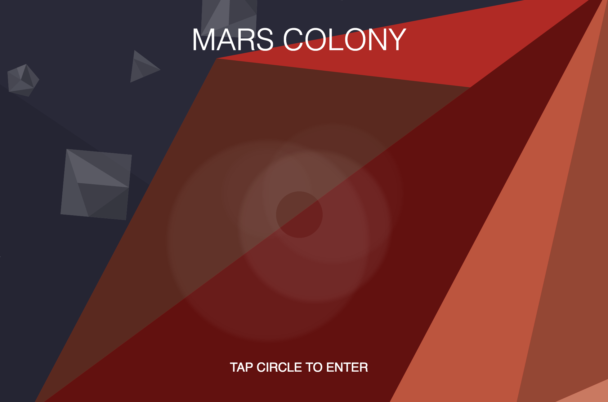

# Project 5: Mars Colony Angular2 App

Project 5 at RED was a big learning curve. This was the first Javascript framework we were taught, so trying to get use to the sytax, and two-way data binding was/is an interesting concept to try and gain an understanding with.

##About the Mars Colony App

The Mars Colony App is an easy to use Single Page application which allows it's users to login, read, and post new alien encounters on the planets Mars.

###Technology Used
This project was generated with [angular-cli](https://github.com/angular/angular-cli) version 1.0.0-beta.10.

- Anuglar2
  * Routing
  * Interfaces/Classes
  * Components
  * ngForm to GET/POST from component templates
  * Angular2 Animations
  * Saving to LocalStorage
- TypeScript
- Postman
  * for the API we were working with.
- HTML5
- SASS & CSS Animations
- Angular CLI
- GIT for version control.

###Rocketing into Anuglar2

##Meaningful Takeaways.